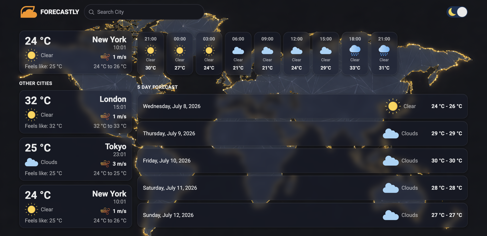
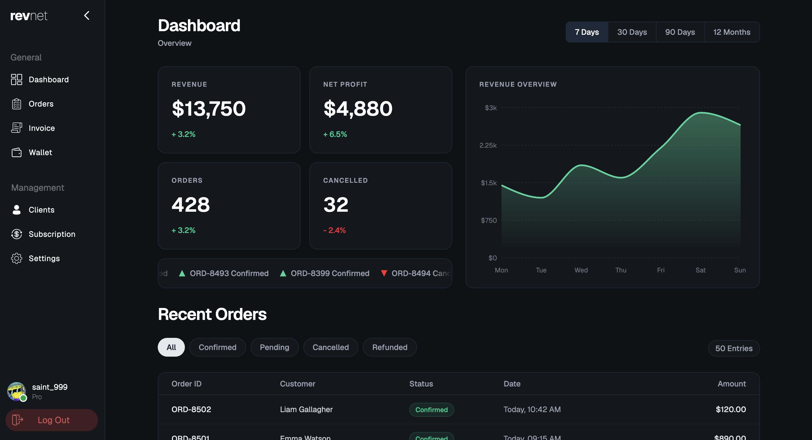

<h1 align="center">Abhinav</h1>

Frontend Developer building modern web experiences with React & TypeScript.

## About Me

I'm a Computer Engineering student passionate about building modern, responsive web applications with a strong focus on clean UI and user experience.

Currently learning **WebSockets**, **Next.js**, and backend development while continuously improving my frontend skills with **React** and **TypeScript**.

# Featured Projects

<table>
<tr>
<td width="100%">

<h3 align="center">Forecastly</h3>

A modern weather application featuring real-time weather, 5-day forecasts, dynamic backgrounds, and a responsive UI.

&nbsp;

&nbsp;

&nbsp;

</td>
</tr>
</table>

 

<table>
<tr>
<td width="100%">

<h3 align="center">RevNet</h3>

A modern social platform focused on clean design, performance, and engaging user experiences.

&nbsp;

&nbsp;

</td>
</tr>
</table>

<h2 align="center">Tech Stack</h2>

<h2 align="center">Connect</h2>

<i>"Building things that are simple, fast, and enjoyable to use."</i>

